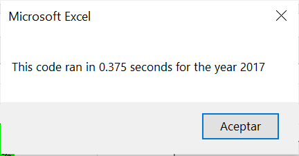
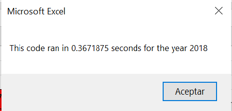

# Wall-Street-Challenge
Green energy Stocks analized with VBA

## Overview of Project 
It´s a deep analysis about how Green energy Stocks performed in 2017 and 2018.

### Purpose 
The purpose is to help Steve to analyze the data that he has collected about stocks, using data of historical information, to facilitate their parents the decision on which stock is good to invert. Also, the project has the purpose of analyzing different data using VBA, learning how to make arrays and loops "for" to increase the deep analysis of the tickers, their volume, and their return. Then, learn how to format the data results to make more visibility information.

## Results 

This image shows how fast our data analysis "All Stocks" runs, after the refactoring we see that in 0.375 seconds is possible to see the Daily volume per ticker, and the Value Return investment. After the refactoring, the velocity was 2.16015 seconds What I did here is make the code easier and faster, which helped Steve bring the information to his parent's visibility faster. 

Also, in this image we can see that the current time is 0.36718 seconds while, the before time was 2.1640 seconds, it happens the same and the refactoring code reduces the time that the VBA do the analysis and shows the results.

As we can see, this table shows that at the end of 2017, almost all the Ticker have a positive return, and the three upper return are from "DQ" with a Return of 199.4%, "SEDG" with a  Return  of 184.5%, and "ENPH" with a return of 129.5%, with a Total Daily Volume of 35,796,200,  206,885,200,  and 221,772,100 respectly. 

image table 2018
While at the end of the 2018, only two tickers have a possitive return "ENPH" and "RUN" wiwth a Return value of 81.9% and 84.0% witha total Daily Volume of 607,473,500 and 502, 757, 100 respectly. 
So, this table shows that the 2018 was a difficult year for the stocks, even though the ticker "RUN" increase their return of 2017 to 2018 and hold his positives results, "ENPH" also continue two years in positives results but in better way, having more than 80% two years consecutivity.  

### Summary

1. What are the advantages or disadvantages of refactoring code?
For me, one disadvantage is that changing a code could be difficult to create when you already have a code that works. With my few knowledge was a challenge, but the advantages are that when it runs, it makes easier the life, with a shorter code and faster too. 

2. How do these pros and cons apply to refactoring the original VBA script?
When I was refactoring my code, I omitted some (i) that make the code run, like the part that I have to write a code to output the results using loop "for" to run the tickers inside the arrays. Was difficult and challenging.
On the other hand, the pros are that using these arrays, it will be easier to run more data like differents years using the same code.  

